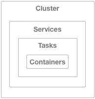

# AWS cli
```
docker run --rm -tiv $HOME/.aws:/root/.aws mikesir87/aws-cli aws --help

docker run --rm -tiv $HOME/.aws:/root/.aws mikesir87/aws-cli aws elasticbeanstalk help


# Pour lire un fichier 
docker run --rm -tiv $HOME/.aws:/root/.aws \
-v $(pwd):/opt/templates --workdir /opt/templates  \
mikesir87/aws-cli \
aws cloudformation validate-template --template-body file://00-master.yaml

```

# Beanstalk - ECS



## Comment from reddit
I wouldn’t do that. If you deploy an elastic beanstalk resource using Cloudformation then the elastic beanstalk service will automatically create that nested stack for you. If you try and do it manually then you won’t be using beanstalk and won’t get the benefits of the management console.

Instead I would use Cloudformation to define an AWS::ElasticBeanstalk::Application as document here: https://docs.aws.amazon.com/AWSCloudFormation/latest/UserGuide/aws-properties-beanstalk.html

And an Environment as seen here: https://docs.aws.amazon.com/AWSCloudFormation/latest/UserGuide/aws-properties-beanstalk-environment.html

Actually, the whole basic structure you need is here: https://docs.aws.amazon.com/AWSCloudFormation/latest/UserGuide/quickref-elasticbeanstalk.html

## Resources

- https://www.trustradius.com/products/aws-elastic-beanstalk/reviews pas génial après qwiklabs "Building Scalable Web Applications with AWS Elastic Beanstalk"

- https://github.com/Tulkis/aws-ebs-moodle
- https://github.com/rennokki/laravel-aws-eb
- https://github.com/aws-samples/eb-php-wordpress
- https://support.tideways.com/article/88-install-on-aws-elastic-beanstalk
- https://aws.amazon.com/about-aws/whats-new/2019/10/aws-elastic-beanstalk-adds-support-for-php-7-3-and-net-core-3-0/
- https://github.com/vanderbilt-redcap/redcap-aws-cloudformation/blob/master/02-rc-elasticbeanstalk.yaml

- https://github.com/bbcarchdev/res_moodle_stack
- https://github.com/netbears/php-mysql-ecs/blob/master/cloudformation-template.yaml
- https://github.com/cfn-modules/docs
- https://docs.aws.amazon.com/AmazonECS/latest/developerguide/using_data_volumes.html
- https://www.unicon.net/insights/blogs/aws-ecs-auto-scaling-part-1

- https://github.com/stelligent/mu
- https://github.com/nathanpeck/awesome-ecs

- https://github.com/awslabs/aws-cloudformation-templates/tree/master/community/services/RDS/aurora-serverless

- https://www.1strategy.com/blog/2017/04/18/cloudformation-visualizing-cross-stack-references/

- https://bref.sh/docs/

# Moodle
- https://github.com/catalyst/moodle-tool_objectfs
- https://objectivefs.com/
- https://danielneis.github.io/moodleparadesenvolvedores/
- https://danielneis.github.io/how-to-use-moodle-27/chapter4.html

# Cloudformation templates

- https://github.com/smalltide/aws-cloudformation-master
- https://github.com/PacktPublishing/AWS-CloudFormation-Master-Class

## Moodle référence
Ce qui ça donne le create stack:
```
Stack description

Stack to deploy a highly available, elastic, scalable Moodle environment. This master stack launches multiple nested stacks for different tiers. !! This can only be run in certain AWS Regions - 'us-east-1', 'us-east-2', 'us-west-2', 'eu-west-1'.

Estimate cost not available

###########################################

The following resource(s) require capabilities: [AWS::CloudFormation::Stack]

This template contains Identity and Access Management (IAM) resources. Check that you want to create each of these resources and that they have the minimum required permissions. In addition, they have custom names. Check that the custom names are unique within your AWS account.Learn more

For this template, AWS CloudFormation might require an unrecognized capability: CAPABILITY_AUTO_EXPAND. Check the capabilities of these resources.
```

## Linter


```
docker run --rm -t -v $(pwd):/opt dougtoppin/cfn-lint 00-master.yaml
```


## Utilisation sceptre

- https://github.com/Sceptre/sceptre
- https://sceptre.cloudreach.com/2.2.1/docs/get_started.html

```
docker run -it --rm -v $(pwd):/project \
-w /project -u 1000:1000 --entrypoint='' \
cloudreach/sceptre:latest sh

sceptre new project moodle
git clone https://github.com/aws-samples/aws-refarch-moodle.git.

# modifier cp commande pour avoir bonne structure
cp -r aws-refarch-moodle/templates/ moodle/templates/
mv templates/ templates01
mv templates01/templates templates
rm -rf templates01/
```
